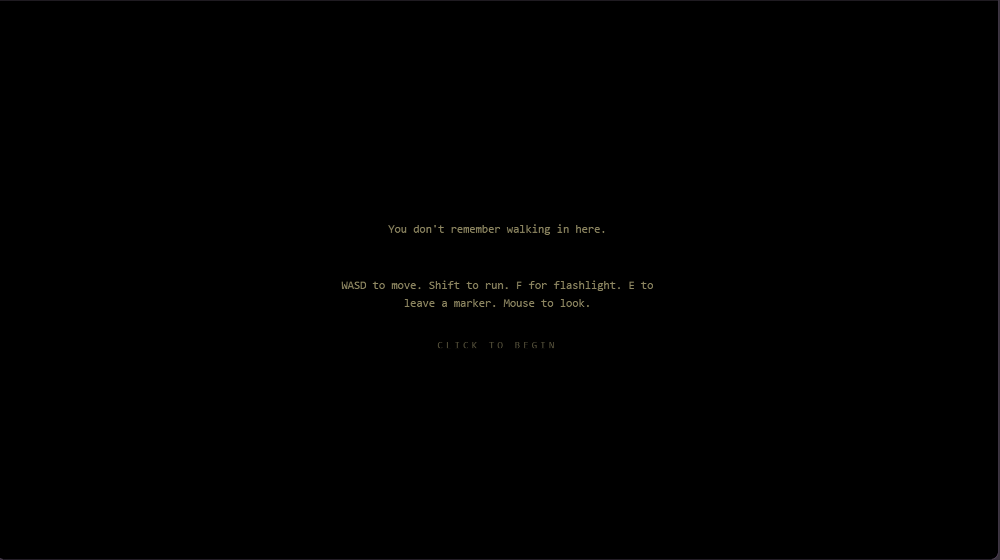
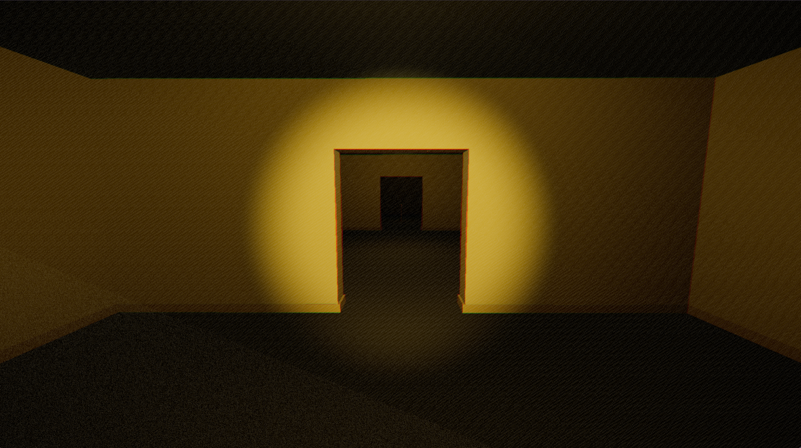
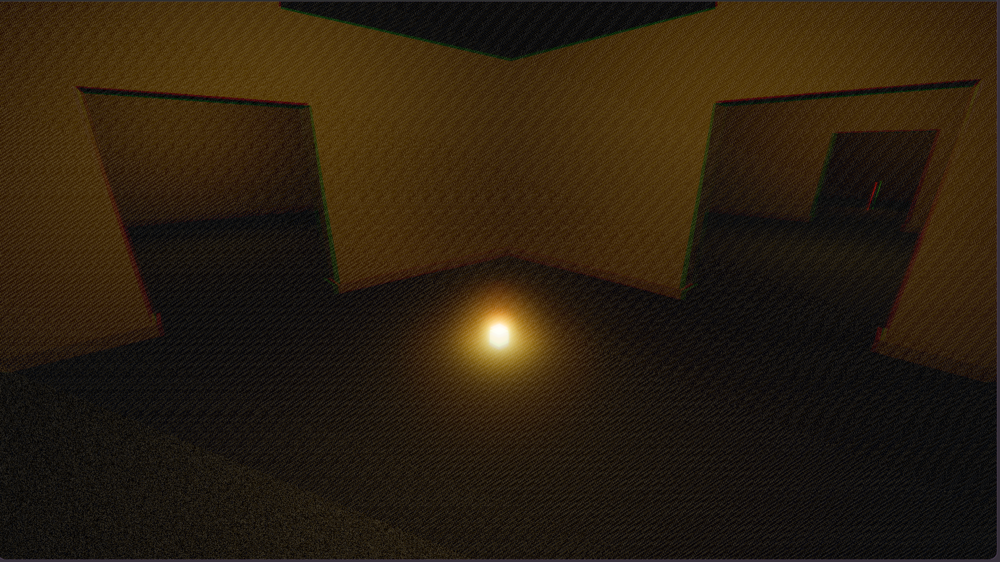
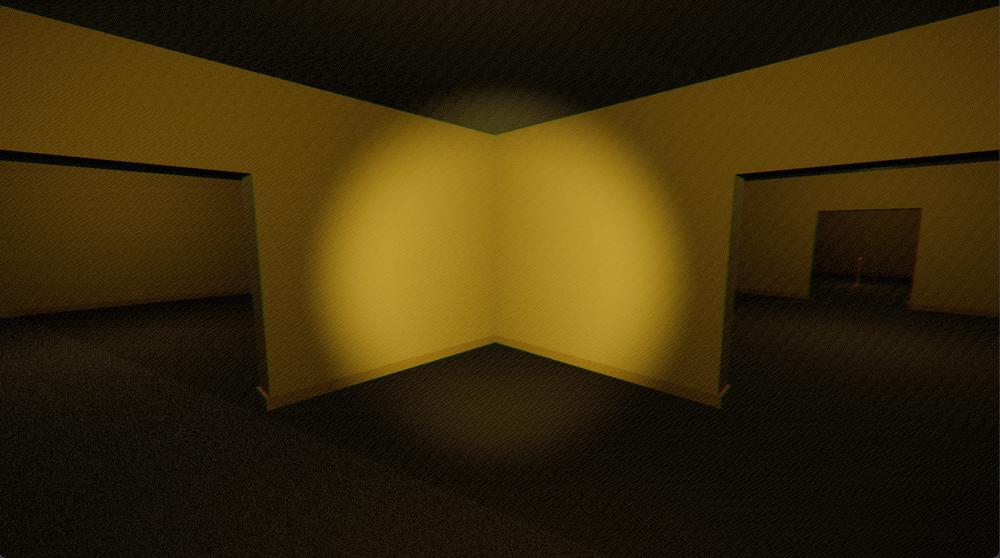
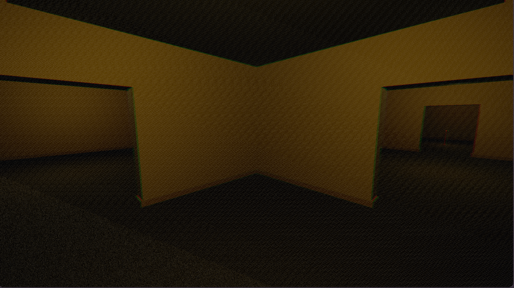

<div align="center">

# backrooms

### a minimal-horror walking sim where the place itself is the threat

<a href="https://backrooms-seven.vercel.app">**▸ play in browser**</a>  ·  <a href="#controls">controls</a>  ·  <a href="#design-philosophy">design</a>  ·  <a href="#architecture">architecture</a>



</div>

---

A short complete first-person horror experience built with **Three.js + TypeScript**, running entirely in the browser. No combat. No jump-scares. No HUD. Five floors of deteriorating reality, three interlocking mechanics, one entity that hears you, and an environment that never confirms whether escape is possible.

The horror comes from subtraction. The space is the antagonist.

> *empty but not safe · familiar but unusable · repetitive but not predictable · silent but never fully still*

---

<div align="center">



*the lobby — yellow wallpaper, fluorescent hum, dread-calm*

</div>

## the loop

```
explore  →  notice  →  doubt  →  survive  →  repeat
```

Every mechanic deepens helplessness. Nothing makes you feel powerful.

---

## three interlocking mechanics

### sanity / disorientation

A single hidden float in `[0, 1]`. There is no bar — sanity is communicated only through what the world does to your senses. As it falls, vision warps and audio collapses inward.

|  state  | what happens |
| ------ | ------------ |
| `1.0` → `0.7` | base decay in seen rooms; subtle film grain |
| `0.7` → `0.4` | chromatic aberration, vignette pulses, FOV drifts on a slow noise wave |
| `0.4` → `0.2` | barrel distortion, audio lowpass closes, delay tail opens, **ghost markers begin** |
| `< 0.2`       | phantom footsteps schedule behind you; novel-tile recovery is halved |

Recovery comes from **genuine novelty** — entering a tile you've never seen, or finding a sparse "anchor" object (a chair, a phone, a lamp).

### sound-reactive threat

A single entity with a five-state machine: *Dormant → Stirring → Alerted → Hunting → Retreating*.

It does not pathfind. It lives in tile-space and moves one room at a time. It hears you — and only you. Walking is loud. Running is louder. **Placing a marker emits a clack with a 6m radius.** Bumping a wall summons it. Phantom footsteps from low sanity do not — but you can't tell the difference.

Hard-capped at **2–3 hunting encounters per playthrough**. The rare ones are the ones you remember.

<div align="center">


*you do not run from this. you stop making noise.*

</div>

### map-fragment markers

Six glowing markers. Drop them where you've been so you can find your way back.

They fade over time. They emit a noise on placement. And below 0.4 sanity, the world begins placing **ghost markers** for you — identical to the real ones, in rooms you've already visited. They despawn silently when you walk near them. You cannot tell real from ghost without revisiting.

Marking your path is the central tension of the game. Every marker you place is a sound the entity can hear, in a memory you may not be able to trust.

<div align="center">



*every marker is a small bargain with the dark*

</div>

---

## controls

| key            | action                                |
| -------------- | ------------------------------------- |
| **W A S D**    | walk                                  |
| **shift**      | run *(louder, drains sanity faster)*  |
| **mouse**      | look                                  |
| **F**          | toggle flashlight                     |
| **E**          | place a marker                        |

The flashlight is the only tool that ever makes anything easier.

<div align="center">
  <table>
    <tr>
      <td align="center">
        <br/>
        <sub><b>flashlight on</b> — fluorescents and warm spill</sub>
      </td>
      <td align="center">
        <br/>
        <sub><b>flashlight off</b> — sanity decays in the dark</sub>
      </td>
    </tr>
  </table>
</div>

---

## the five floors

| # | floor              | introduces                                                  | duration |
| - | ------------------ | ----------------------------------------------------------- | -------- |
| 0 | **lobby**          | movement, flashlight, marker placement                      | ~3 min   |
| 1 | **offices**        | looped corridors that never end                             | ~5 min   |
| 2 | **parking garage** | first scripted hunting encounter, blink-teleport            | ~6 min   |
| 3 | **flooded halls**  | shifting geometry behind you, ghost markers, second hunt    | ~6 min   |
| 4 | **the same room**  | one tile, repeated. find the one that is not the same      | ~5 min   |
| 5 | **exit**           | anti-resolution — or, if you kept your wits, a way out      | ~3 min   |

Each floor is procedurally stitched from authored tile templates with a deterministic seed. Same seed, same maze.

<div align="center">


*the threshold to the next floor — easy to miss if you're not looking*

</div>

---

## design philosophy

The fear in a backrooms game does not come from escalation. It comes from subtraction. Strip away the lore, the monsters, the combat, the cinematic violence — and what is left is the only thing that ever needed to be there: the feeling of being **wrongly located**.

The loop is small on purpose:

- **Familiar but unusable.** Spaces designed for use, with the use removed.
- **Empty but not safe.** Quiet enough to think, but thinking becomes unproductive.
- **Repetitive but not predictable.** You see the same room twice and you do not feel relief.
- **Silent but never fully still.** A noise might be danger or it might be the building breathing in its own mechanical way.

A perfect minimal-horror game does not need a complicated mythology. The fear is architectural and psychological, not narrative. The player's imagination fills in the missing danger — and that is always stronger than over-explaining it.

---

## architecture

```
src/
├── core/         GameLoop · EventBus · Time · Input · main
├── render/       Renderer · Composer · Fader
├── player/       PlayerController · CapsuleCollider · Flashlight · Footsteps
├── audio/        AudioBus  (raw Web Audio · PannerNode · BiquadFilter · DelayNode)
├── sanity/       SanitySystem · postfx/SanityPass
├── markers/      Marker · MarkerSystem
├── entity/       ThreatEntity · ThreatFSM · Hearing
└── level/        Tile · Floor · Theme · Stitcher · SeamTricks
                  ExitMarker · AnchorDetail · AnchorSystem · FloorManager
                  └── floors/ (Floor0Lobby … Floor5Exit)
```

Plain class composition over an event bus. No ECS, no physics library — collision is a hand-rolled capsule-vs-AABB sweep, ~80 lines, full control over teleport seams. Audio is raw Web Audio so the listener orientation, lowpass closure, and delay tail can be modulated by sanity in real time.

The three mechanics interlock through events — `noise.emitted`, `sanity.changed`, `tile.entered`, `entity.statechange` — never direct calls. That is what lets running from the entity drain your sanity, which makes you hear footsteps that aren't there, which makes you doubt whether the entity is actually behind you.

---

## running locally

```bash
npm install
npm run dev      # http://127.0.0.1:5173
npm run build    # production bundle (~150 KB gzipped)
npm test         # 34 unit tests for the pure modules
```

Headphones recommended. Audio is most of the horror.

---

## credits

Built with [Three.js](https://threejs.org), [Vite](https://vitejs.dev), and [TypeScript](https://www.typescriptlang.org). All audio is procedurally synthesized in the browser via the Web Audio API — no asset files.

<div align="center">

—

*it never quite ends.*

</div>
